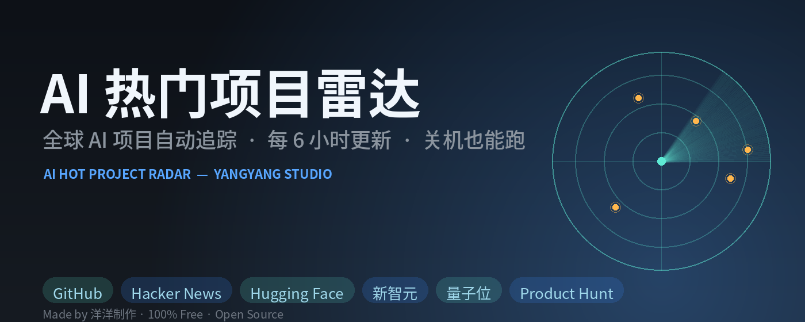
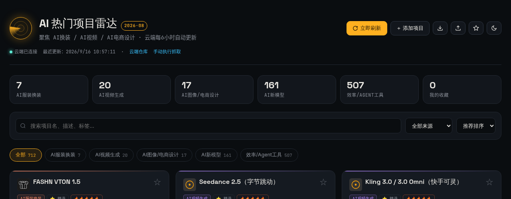
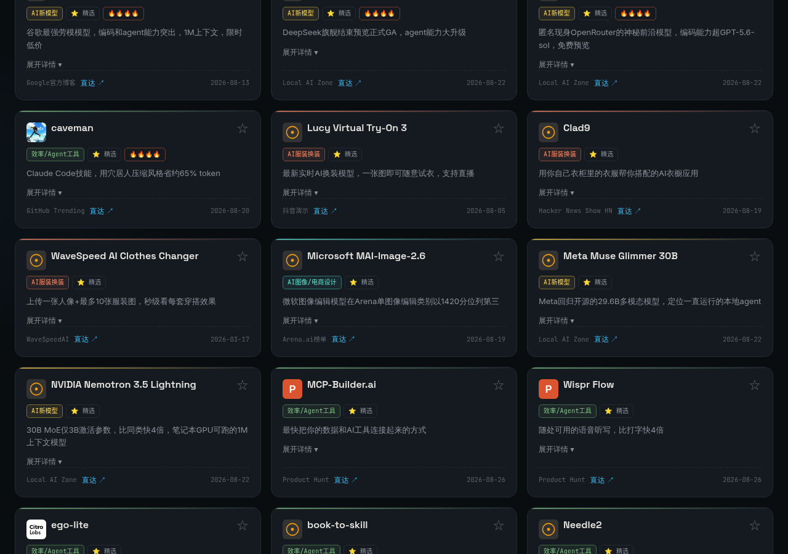
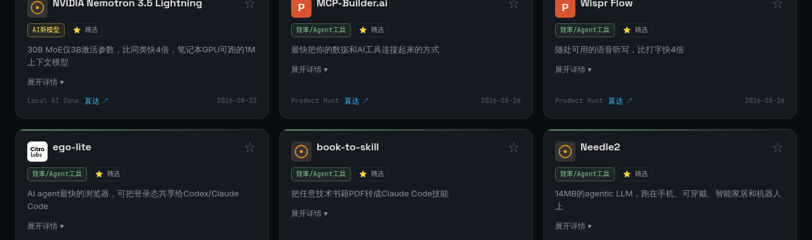
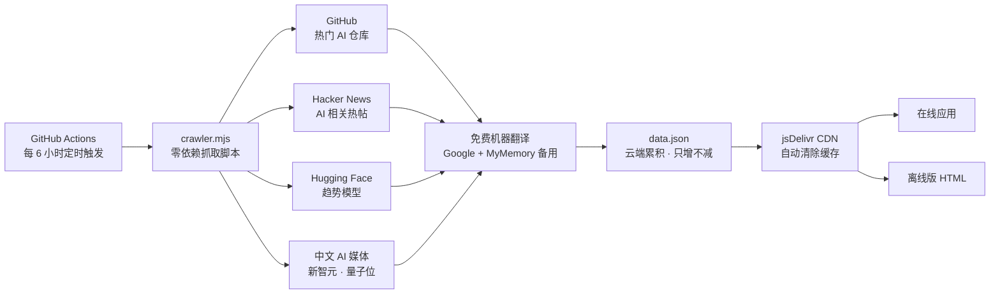

<p align="center">
  
</p>

<h1 align="center">AI 热门项目雷达 🛰️</h1>

<p align="center">
  <b>由 洋洋制作 出品</b> · 100% 免费开源 · 全球 AI 热门项目自动追踪
</p>

<p align="center">
  <a href="https://github.com/yyds8170-ctrl/ai-hot-radar/actions"></a>
  
  
  
  
</p>

<p align="center">
  <b>聚焦 AI 换装 / AI 视频 / AI 电商设计 / AI 新模型 / Agent 工具</b><br>
  自动抓取全球热门 AI 项目 → 免费翻译成中文 → 云端定时更新 → 多端随时查看
</p>

---

## ✨ 它能做什么

| 能力 | 说明 |
|---|---|
| 🌍 **全球多源抓取** | 同时监控 GitHub、Hacker News、Hugging Face、新智元、量子位等 6 大信源 |
| 🗣️ **免费中文翻译** | 英文简介自动翻译成中文（Google + MyMemory 双通道，失败自动降级保留原文） |
| ⏰ **云端定时更新** | GitHub Actions 每 6 小时自动抓取一次，**你关机它也在跑** |
| 📈 **只增不减累积** | 历史项目永久保留，越用数据越丰富，永远不会变少 |
| 🏷️ **自动分类** | AI服装换装 / AI视频生成 / AI图像电商设计 / AI新模型 / 效率Agent工具 |
| 🆕 **本周新增高亮** | 新抓取的项目自动打上 NEW 徽章，一眼看到最新热点 |
| 🎨 **项目图标** | GitHub 项目显示官方头像、HF 模型显示官方 Logo、各信源专属彩色图标 |
| 📱 **多端可用** | 在线应用（浏览器直接打开）+ 离线版 HTML（双击即用，可在任何电脑运行） |

---

## 📸 界面预览

### 主界面 —— 云端数据 + 实时统计

<p align="center">
  
</p>

顶部实时统计各分类项目数（当前已累积 **700+ 条**），支持搜索、分类筛选、来源筛选、热度排序，云端连接状态一目了然。

### 精选项目 —— 人工精挑 + 详细中文介绍

<p align="center">
  
</p>

⭐ **精选 32 个重磅项目**：AI 换装 / AI 视频 / AI 电商设计 / AI 新模型 / Agent 工具全覆盖，每个项目带详细中文介绍、热度评分、直达链接，点"展开详情"看完整分析。

### 自动抓取 —— NEW 徽章 + 免费中文翻译

<p align="center">
  
</p>

📌 **自动抓取项目**：每 6 小时从全球信源自动收录，**NEW 徽章**标注本周新增，英文简介已**自动翻译成中文**（如 "Small Models Have Arrived" → "小型号已经到货"），看不懂英文也能快速了解项目。

- 🔥 热度评分、NEW 本周新增标识、来源直达链接、一键展开详情

---

## 🚀 快速开始

### 方式一：在线应用（推荐）

直接打开浏览器访问，无需安装，任何设备可用（已部署在 GitHub Pages，永久免费）：

> **https://yyds8170-ctrl.github.io/ai-hot-radar/**

### 方式二：离线版 HTML

下载 [`docs/离线版.html`](docs/离线版.html)，**双击即可运行**，无需联网安装，可拷贝到任何电脑使用（数据自动从云端 CDN 同步）。

> 💡 想了解全部功能的详细操作？看 [`docs/使用说明.html`](docs/使用说明.html)，图文并茂的完整使用手册。
>
> 🧰 所有版本与下载入口（离线版 / 使用说明 / 云端数据 / 版本历史）汇总在 **[下载中心](docs/download.html)**。

---

## 🗂️ 数据来源

| 信源 | 抓取内容 | 数量上限 |
|---|---|---|
| 🌟 GitHub | 16 组关键词搜索（AI换装/视频/图像/Agent/MCP/开源模型等）近两月活跃仓库，按 star 排序 | 40 |
| 📰 Hacker News | topstories + showstories 中 AI 相关热门帖（30 分以上） | 30 |
| 🤗 Hugging Face | 趋势榜（trendingScore）最热模型 | 60 |
| 🔬 新智元 | 中文 AI 媒体最新文章 | 15 |
| 💬 量子位 | 中文 AI 媒体最新文章 | 15 |
| 🚀 Product Hunt | 当日热门 AI 产品 | 10 |

所有数据抓取后经过去重（按项目唯一 id）合并，再经过免费机器翻译，最后写入 `data.json`。

---

## ⚙️ 工作原理



**全链路自动化，你只需要做一件事：打开应用看结果。**

- `.github/workflows/crawl.yml` — GitHub Actions 定时任务（每 6 小时 + 手动触发 + 代码推送触发）
- `crawler.mjs` — 零依赖 Node 抓取脚本（Node 18+ 即可运行，无需安装任何依赖）
- `data.json` — 输出数据：`curated`（精选 32 条）+ `auto`（自动累积，只增不减）
- 抓取完成后自动调用 jsDelivr Purge API 清除 CDN 缓存，保证各端数据实时一致

---

## 🕹️ 手动触发一次抓取

不想等定时任务？三步手动抓取：

1. 打开仓库 [Actions](https://github.com/yyds8170-ctrl/ai-hot-radar/actions) 页面
2. 左侧选择 **「定时抓取AI热门项目」** 工作流
3. 点击右侧 **Run workflow** → 绿色按钮确认，等 1-2 分钟完成

抓取完成后数据自动更新到 CDN，刷新应用即可看到最新结果。

---

## 📦 数据结构

`data.json` 中的每个项目：

```json
{
  "id": "sha1哈希唯一标识",
  "name": "项目名称",
  "summary": "英文原始简介",
  "summary_zh": "免费翻译的中文简介（翻译失败则为空）",
  "category": "AI服装换装 | AI视频生成 | AI图像/电商设计 | AI新模型 | 效率/Agent工具",
  "tags": ["开源", "虚拟试衣"],
  "link": "项目直达链接",
  "source": "GitHub | Hacker News | Hugging Face | 新智元 | 量子位",
  "date": "抓取日期 YYYY-MM-DD",
  "hotness": "热度评分 1-5"
}
```

---

## ❓ 常见问题

**Q：我电脑关机了，抓取还会继续吗？**
会。抓取跑在 GitHub 的云端服务器上（GitHub Actions），与你电脑完全无关，关机、断网都不影响。

**Q：项目会越来越少吗？**
不会。采用"只增不减"累积模式，历史项目永久保留。应用内提供"本月热门"筛选，想看当月热点一键过滤。

**Q：翻译真的免费吗？**
真的。使用 Google Translate 免费接口 + MyMemory 免费 API 双通道，不需要任何 API Key。翻译失败自动降级保留英文原文，绝不影响应用运行。

**Q：翻译会不会把应用搞崩？**
不会。设计了 8 秒超时、失败自动换备用源、翻译失败跳过、不阻塞主流程共 6 层保护。翻译只是锦上添花，失败就显示英文。

**Q：数据存在哪里？**
存在本仓库的 `data.json` 里，通过 jsDelivr CDN 全球分发，所有端共享同一份数据。

**Q：可以自己加项目吗？**
可以。在线应用和离线版都支持手动添加项目，也能导入/导出 JSON 数据。

---

## 📜 更新日志

| 日期 | 版本 | 更新内容 |
|---|---|---|
| 2026-09 | v3.0 | 项目图标（GitHub 头像 / HF Logo / 信源专属图标）、README 全面美化 |
| 2026-08-29 | v2.1 | 免费机器翻译（Google+MyMemory 双通道，全降级保护），英文简介自动转中文 |
| 2026-08-28 | v2.0 | 修复 CDN 缓存问题、按唯一 id 去重、数据恢复完整 |
| 2026-08-27 | v1.5 | 云端累积模式（只增不减）、本月热门筛选、本周新增高亮 |
| 2026-08-26 | v1.0 | 多数据源扩展（Hugging Face + 中文媒体）、修复中文源 id 冲突 |

---

## ⚖️ 许可证

本项目采用 **PolyForm Noncommercial 1.0.0** 许可协议 —— 可自由查看、学习、分析源码，**禁止商业使用与商业 AI 训练**。

<p align="center">
  <b>Made with ❤️ by 洋洋制作</b><br>
  <sub>AI 热门项目雷达 · 免费开源 · 持续迭代中</sub>
</p>
